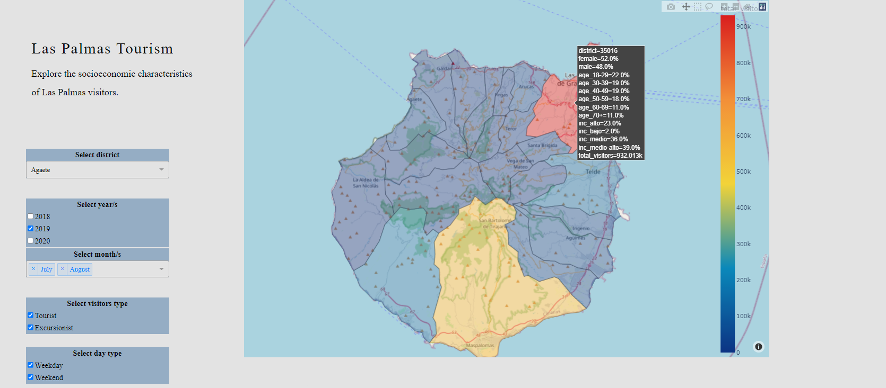
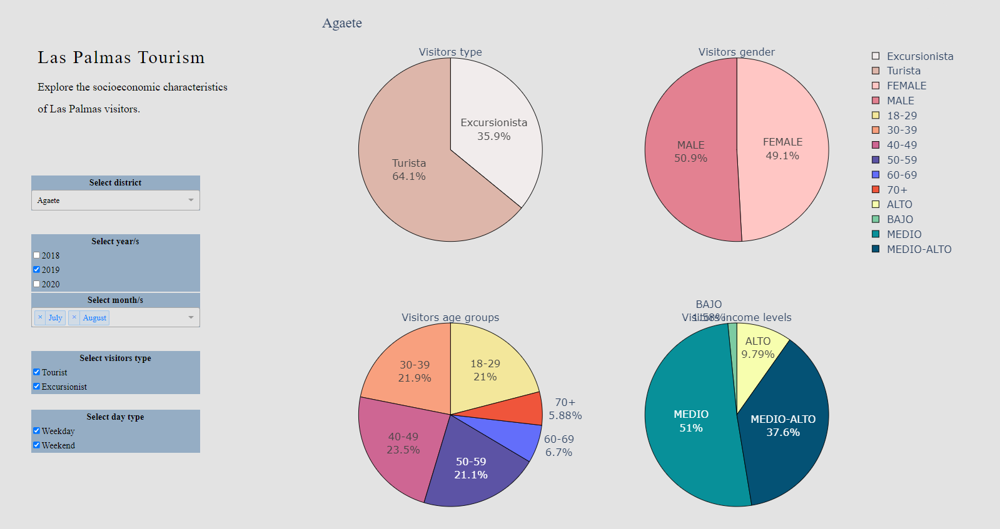

<h1>Smart Destination Challenge<h1>

Dashboard created for the Datathon competition of data analysis of tourism in Gran Canaria, Spain. https://smartdest.herokuapp.com/

<h3>Objective<h3>

The organization provided the participants with 173 datasets related to tourism in Gran Canaria, Spain. It was an open competition in the sense that there was no specific goal or question to answer, we were simply asked to come up with a value propositon for the data.

<h3>Solution<h3>

The proposed solution pretends to improve the tourism offer in the different regions of Las Palmas by enabling the identification of tourist profiles visiting the isle in function of the district and the time of the year. This information can be used by municipalities and commerces to better understand their visitors and adapt their services to their clients leisure interests and economical capabilities.

The datasets used provide information regarding the age, gender, income and type of visitors of the different districts in Las Palmas by year and month. This information is captured and visualized in the developed Dashboard during the Datathon.

